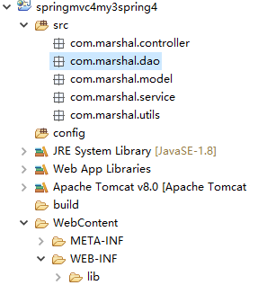

## 1.2 创建并搭建项目

打开eclipse并创建web项目。

1: 在项目src目录下创建如下包：

    com.marshal.controller
    com.marshal.dao
    com.marshal.model
    com.marshal.service
    com.marshal.utils

2: 另外需要再创建一个资源包:

    config

3：导入项目所需要的jar包。

项目目录结构如下图所示：

 
